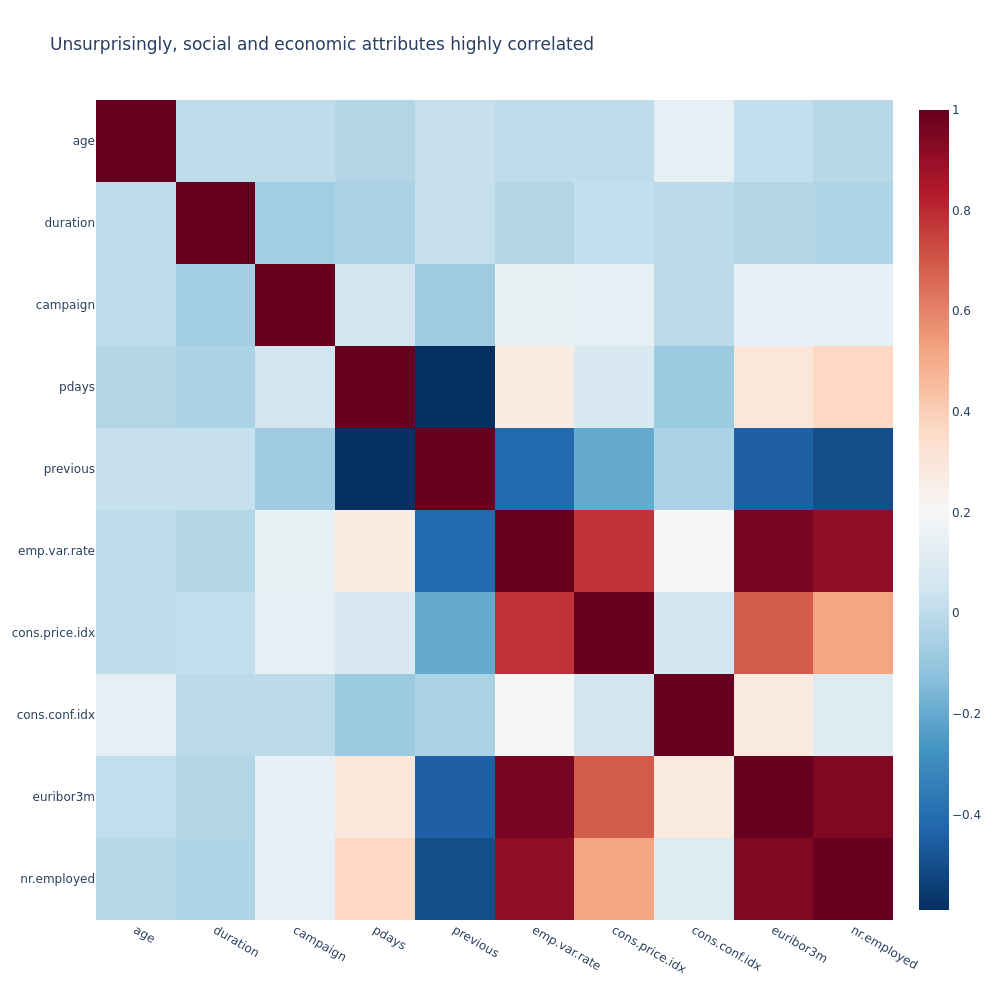
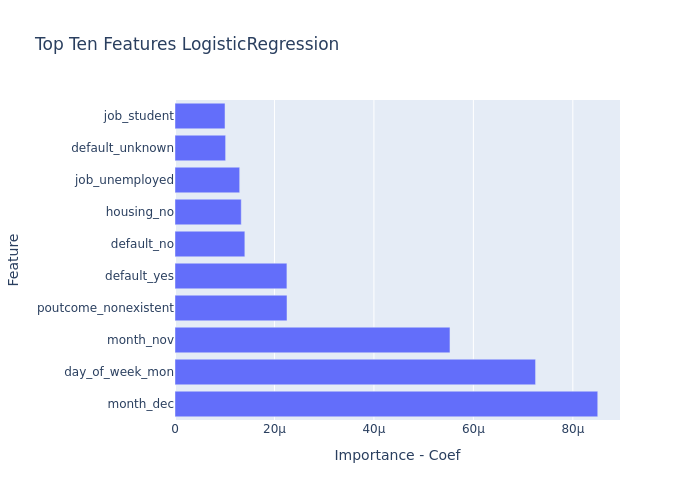
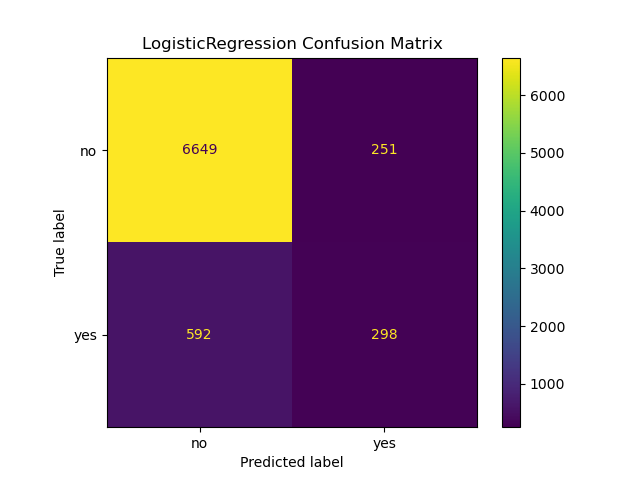
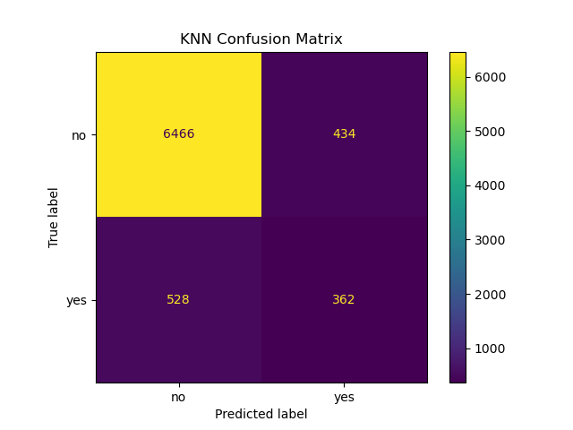
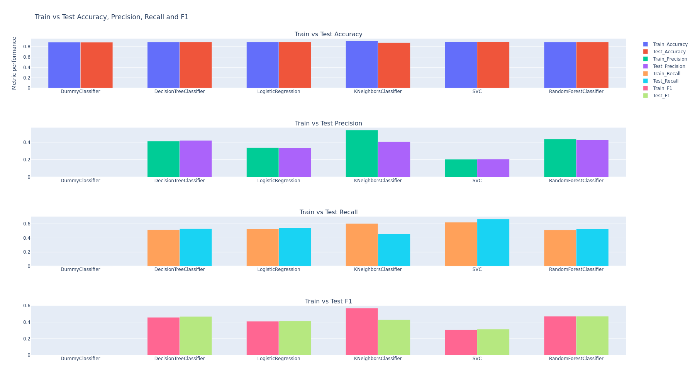
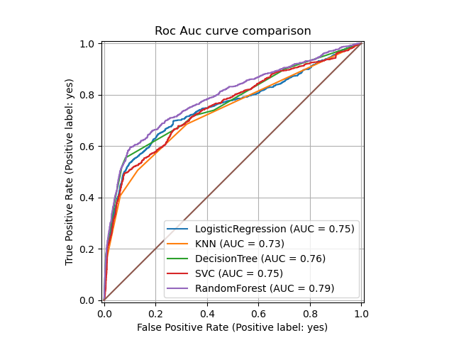
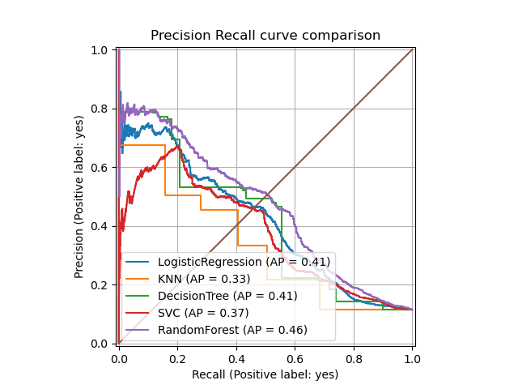

# bank-marketing

A repository focused on assessing whether someone will accept a marketing campaign

## Table of Contents

- [Link to notebook](#link-to-notebook)
- [Local Installation](#local-installation)
- [About the Dataset](#about-the-dataset)
- [Understanding the business](#understanding-the-business)
- [Understanding the features](#understanding-the-features)
- [Understanding the data](#understanding-the-data)
    - [Imbalance in the data](#imbalance-in-the-data)
    - [Univariate and Multivariate Analysis](#univariate-and-multivariate-analysis)
        - [Age analysis](#age-analysis)
        - [Job analysis](#job-analysis)
        - [Education analysis](#education-analysis)
        - [Month analysis](#month-analysis)
        - [Duration analysis](#duration-analysis)
        - [Calls analysis](#calls-analysis)
        - [Calls X Duration analysis](#calls-x-duration-analysis)
        - [Days since last contact analysis](#days-since-last-contact-analysis)
        - [Correlation Matrix](#correlation-matrix)
        - [Consumer price index analysis](#consumer-price-index-analysis)
        - [Consumer confidence index analysis](#consumer-confidence-index-analysis)
        - [Previous outcome analysis](#previous-outcome-analysis)
- [Data Preparation](#data-preparation)
   - [Cleaning](#cleaning)
   - [Defining our transformers](#defining-our-transformers)
- [Models and Evaluation](#models-and-evaluation)
  - [ML Flow](#ml-flow)
  - [Baseline](#baseline)
  - [DecisionTree](#decisiontree)
  - [LogisticRegression](#logisticregression)
  - [KNearestNeighbors](#knearestneighbors)
  - [Support Vectors Classifier](#support-vector-classification)
  - [RandomForest](#randomforest)
  - [Metric comparison](#metric-comparison)
- [Next Steps and Recommendations](#next-steps-and-recommendations)

## Link to notebook

[Primary Notebook](https://github.com/mattdabit/bank-marketing/blob/main/bank_marketing.ipynb)

## Local Installation

1. Clone the repository
2. Use a python environment manager. I prefer conda.
3. Create and activate conda environment
    ```
    conda env create -f environment.yml   
    conda activate bank
    ```

## About the Dataset

The dataset was procured from
the [UC Irvine Machine Learning Repository](https://archive.ics.uci.edu/ml/datasets/bank+marketing). The data is from a
Portuguese bank. It contains a collection of marketing campaigns. The dataset is not missing any values and only contains
12 duplicates. I was quite inspired by
the [paper](https://github.com/mattdabit/bank-marketing/blob/main/CRISP-DM-BANK.pdf) written by Sérgio Moro and Raul M.
S. Laureano.
In my analysis I did find that some of their data findings do not match what I have in the dataset.

## Understanding the business

It comes as no surprise that large marketing campaigns have negative sentiment amongst the general populace. Think about
the last time you answered an unexpected phone call from an unknown number, if your experience is anything like my then,
it was either a scam caller, telemarketer, or survey taker. I find myself hanging up quickly when it comes to these types
of calls, if I were to ever answer them. Every failed cold call costs the company commissioning the campaign time and
money. The bank partner commissioning this study is seeking to increase campaign success and reduce costs by focusing on
profiles that are more likely to accept their offerings. The bank partner would like a model that can better predict the
type of person that would accept offers from our partner bank.

## Understanding the Features

```
Input variables:
# bank client data:
1 - age (numeric)
2 - job : type of job (categorical: 'admin.','blue-collar','entrepreneur','housemaid','management','retired','self-employed','services','student','technician','unemployed','unknown')
3 - marital : marital status (categorical: 'divorced','married','single','unknown'; note: 'divorced' means divorced or widowed)
4 - education (categorical: 'basic.4y','basic.6y','basic.9y','high.school','illiterate','professional.course','university.degree','unknown')
5 - default: has credit in default? (categorical: 'no','yes','unknown')
6 - housing: has housing loan? (categorical: 'no','yes','unknown')
7 - loan: has personal loan? (categorical: 'no','yes','unknown')
# related with the last contact of the current campaign:
8 - contact: contact communication type (categorical: 'cellular','telephone')
9 - month: last contact month of year (categorical: 'jan', 'feb', 'mar', ..., 'nov', 'dec')
10 - day_of_week: last contact day of the week (categorical: 'mon','tue','wed','thu','fri')
11 - duration: last contact duration, in seconds (numeric). Important note: this attribute highly affects the output target (e.g., if duration=0 then y='no'). Yet, the duration is not known before a call is performed. Also, after the end of the call y is obviously known. Thus, this input should only be included for benchmark purposes and should be discarded if the intention is to have a realistic predictive model.
# other attributes:
12 - campaign: number of contacts performed during this campaign and for this client (numeric, includes last contact)
13 - pdays: number of days that passed by after the client was last contacted from a previous campaign (numeric; 999 means client was not previously contacted)
14 - previous: number of contacts performed before this campaign and for this client (numeric)
15 - poutcome: outcome of the previous marketing campaign (categorical: 'failure','nonexistent','success')
# social and economic context attributes
16 - emp.var.rate: employment variation rate - quarterly indicator (numeric)
17 - cons.price.idx: consumer price index - monthly indicator (numeric)
18 - cons.conf.idx: consumer confidence index - monthly indicator (numeric)
19 - euribor3m: euribor 3 month rate - daily indicator (numeric)
20 - nr.employed: number of employees - quarterly indicator (numeric)

Output variable (desired target):
21 - y - has the client subscribed a term deposit? (binary: 'yes','no')
```

## Understanding the data

The first thing that jumps out is how imbalanced the dataset is.
This is to be expected considering that we are working
with telemarketing data.
I was also able to find some strong predictors for the accepting class.
In particular, the
following fields show strong promise: month, employment, number of contacts.
It is also important to note that the pdays
column using 999 to signify that fact the client was not priorly contacted.
The author of this dataset also recommends
avoiding the duration column as it highly affects the output.
Intuitively, this makes sense as well,
we cannot use duration as an input to our models
as it is not something we would know before we phone a potential customer.

### Imbalance in the data


Here you can see the lack of balance. As spoken about before, this is expected with telemarketing campaigns.

### Univariate and Multivariate Analysis

#### Age analysis


In the above box plot we see that a majority of contacts are between the ages of 32 and 47.


Here we notice that the younger and older contacts are more likely to accept. We see some strange behavior going on when
we creep pass the upper fence of the box plot. It may be valuable to introduce a cutoff age to ensure our models do not
over
index on age.

#### Job analysis


Given what we learned about the correlation between age and acceptance rate, it should come to no surprise that students
and
retirees are more likely to accept a campaign.

#### Education analysis


I wanted to see how strong an impact education would have on concerning the target.
The correlation does not seem present; however, those that are illiterate are more likely than other categories to
accept the campaign.

#### Month analysis


Timing seems to be an important factor in these campaigns.
In particular, March, December, September, and October all had high
acceptance rates.
We may be able to leverage this as a business to reduce costs during slow months.
This somewhat differs from the paper
which found that June was a very successful month.

#### Duration analysis


The duration of a call seems to be a strong predictor; the longer someone is on the phone, the more likely they will accept.
However, we see this note from the author of the dataset.
`Important note: this attribute highly affects the output target (e.g., if duration=0 then y='no'). Yet, the duration is not known before a call is performed. Also, after the end of the call y is obviously known. Thus, this input should only be included for benchmark purposes and should be discarded if the intention is to have a realistic predictive model.`
Given that we cannot use this value in our modeling, I will drop it from the training data.
It is still important to study it to give insight to the business on how they should train their employees.

#### Calls analysis


The number of calls may have a negative correlation with campaign acceptance.
That is the more you call a prospect, the more likely they will say no.

#### Calls X Duration analysis


I was surprised by this finding. I would have expected that the more calls would lead to brief conversation if a person
 picked up, but there is barely a correlation between the values. 

#### Days since last contact analysis


The histogram above indicates that the best time to follow up with a customer is within the week of the first call.
I would not be surprised
if the banking institution provided guidance to their employees
to call on the 3rd and 6th days after their first call.  

#### Correlation Matrix



Social and economic attributes are highly correlated.
This fact may lend itself to PCA or early feature pruning.
The number of contacts and number of days
that passed by after the client was last
being negatively correlated is also not surprising.
We should be careful of multicollinearity with our dataset.
This won't be an issue for decision trees and SVM models, but it will be for logistic regression. 

#### Consumer price index analysis


The consumer price index looks static across the various levels.
Now it seems like the ratio of acceptance goes up at the 94.25 value, 
but without more data I would hesitate to make a judgment. 

#### Consumer confidence index analysis


Consumer confidence may affect acceptance. I am not entirely convinced considering that the acceptance count
seems stagnant for the 3 index ratings with the most calls.
It is promising to see the ratio of acceptance jump with the `-32.5` rating.
However, this could just be an outlier. 

#### Previous outcome analysis


Retention is over 65% for customers that previously accepted a campaign.
It may be prudent to contact these types of customers to see why they chose our product. 

## Data Preparation

### Cleaning
In accordance with the data author's recommendation, I dropped the duration column.
In addition, I used the IQR method to remove outliers on age. 

### Defining our transformers
I added 3 transformers, a StandardScaler, OneHotEncoder, and PolynomialFeatures. 

## Models and Evaluation]
I create 5 different types of models: LogisticRegression, DecisionTree, KNearestNeighbors, SVC, and RandomForest.
I decided to prioritize precision for all models.
Accuracy is not the best measure for imbalanced datasets.
The primary goal of our models is to determine if a customer is likely to accept the campaign.
Ideally, the business will not want to chase dead leads; this wastes time and money.
This would mean that precision is the ideal metric because of how precision penalizes false positives.
With high precision we can prioritize those with a high acceptance rate.
Since our positive label (`pos_label`) is `yes`, our negative label is `no`.
A false positive in this case would be something our model would predict
as `yes` but it reality it would have been a `no`.
A false negative in this case would be something our model would predict
as `no` but it reality it would have been a `yes`.
Now this is only in the context of our training and test data,
in reality post-call surveys would be needed to better capture our model's true performance in the real world.
Since our baseline hit rate is around 12%, yes, a marginal increase would be a gigantic success.

### ML Flow
In my prior project I had trouble experiment tracking.
To better track my experiments, I use MLFlow.
For others, I have also committed the files for MLFlow.
Simply run `mlflow ui` to bring up the GUI for MLFlow and see the experiments I ran. 

### Baseline
Our baseline model predicts on frequency.
This will give accuracy of around 88%.
This may seem great at first look, but considering that our dummy classifier will always predict `no`
it is absolutely useless. 

### DecisionTree
Here are the hyperparameters for the decision tree model. 
```python
params = {
    "smote__k_neighbors": [3, 5],
    "smote__sampling_strategy": [0.3, 0.5],
    "tree__criterion": ["gini", "entropy"],
    "tree__max_depth": [3, 4, 5],
    "tree__min_samples_split": [4, 5],
    "tree__min_samples_leaf": [3, 4, 5],
    "preprocessor__poly__degree": [2, 3],
}
```
Here are the best parameters for the decision tree model.
```json 
{
    "preprocessor__poly__degree": 2,
    "smote__k_neighbors": 5,
    "smote__sampling_strategy": 0.3,
    "tree__criterion": "entropy",
    "tree__max_depth": 5,
    "tree__min_samples_leaf": 5,
    "tree__min_samples_split": 4
}
```
I used these parameters to reduce the number of parameters for my random forest model.
It took 14.7 minutes to train the model. 


The top features of the decision tree model did not match the paper.
The day of the week seemed to be the most important feature for the decision tree model.
Additionally,
the consumer confidence index and the employment variation rate times the number of prior contacts were top features. 
In a future experiment we ought
to remove the PolynomialFeatures to see if that was adversely affecting the decision tree.


In the above confusion matrix we see that the decision tree model is balanced.
We do see
that we get more true positives than false positives, 
meaning at least 50% of the time our model accurately predicts the positive class.

### LogisticRegression
Here are the hyperparameters for the logistic regression model.
```python
params = {
    "smote__k_neighbors": [3, 5],
    "smote__sampling_strategy": [0.3, 0.5],
    "lr__penalty": ["l1", "l2", "elasticnet"],
    "lr__max_iter": [500, 1000],
    "lr__C": [0.01, 0.1, 1],
    "preprocessor__poly__degree": [2, 3],
}
```
Here are the best parameters for the logistic regression model.

```json
{
  "lr__C": 0.1,
  "lr__max_iter": 500,
  "lr__penalty": "l2",
  "preprocessor__poly__degree": 2,
  "smote__k_neighbors": 5,
  "smote__sampling_strategy": 0.3
}
```

It took 21 minutes to train the model.
Regularization did have an impact on the coefficients. 



The top feature of the logistic regression model was the month.
This also was one of the top features in the paper.



The model was just as accurate as the other models, but as we can see that is because it mostly predicted `no`.
The number of true positives for the logistic regression model was not as good as the other models. 

### KNearestNeighbors
Here are the hyperparameters for the k nearest neighbors model.
```python
params = {
    "smote__k_neighbors": [3, 5],
    "smote__sampling_strategy": [0.3, 0.5],
    "knn__n_neighbors": [3, 5],
    "preprocessor__poly__degree": [2, 3],
}
```
Here are the best parameters for the k nearest neighbors model.

```json
{
  "knn__n_neighbors": 5,
  "preprocessor__poly__degree": 3,
  "smote__k_neighbors": 5,
  "smote__sampling_strategy": 0.3
}
```
It took 1 minute to train the model.



The KNN model overall was the worst model when comparing test and training metrics.
We likely overfitted this model.
While the confusion matrix for this model looks good,
the drop-in performance between the train and test datasets makes this model less appealing.

### Support Vector Classification.

Here are the hyperparameters for the support vector classification model.
```python
params = {
    "smote__k_neighbors": [3, 5],
    "smote__sampling_strategy": [0.3, 0.5],
    "svc__C": [0.01, 0.1, 1],
    "preprocessor__poly__degree": [2, 3],
}
```
Here are the best parameters for the support vector classification model.

```json
{
  "preprocessor__poly__degree": 2,
  "smote__k_neighbors": 3,
  "smote__sampling_strategy": 0.3,
  "svc__C": 0.1
}
```
It took 2.4 hours to train the model.
With the SVC model I had to cancel several runs for the length of time it was taking.


The SVC model performed the best concerning recall, but it performed the worst concerning precision.
This makes it an unreliable model for our business.

### RandomForest

Here are the hyperparameters for the random forest model.
```python
params = {
    "smote__k_neighbors": [3, 5],
    "smote__sampling_strategy": [0.3, 0.5],
    "forest__n_estimators": [100, 200],
    "forest__max_depth": [3, 4, 5],
    "forest__min_samples_split": [4, 5],
    "forest__min_samples_leaf": [3, 4, 5],
    "preprocessor__poly__degree": [2, 3],
}
```
Here are the best parameters for the random forest model.
```json
{
    "forest__max_depth": 5,
    "forest__min_samples_leaf": 3,
    "forest__min_samples_split": 4,
    "forest__n_estimators": 200,
    "preprocessor__poly__degree": 2,
    "smote__k_neighbors": 5,
    "smote__sampling_strategy": 0.3
}
```

It took 1.3 hours to train the model.


The top features for the random forest model were day of the week, loan status, and prior outcomes.
I would have expected month to show up here to match the paper and our findings in our data analysis.


The confusion matrix for the random forest models shows that it was the best when identifying true positives.
This makes it our leading model. 

### Metric comparison
<table>
    <thead>
        <tr>
            <th>Model Name</th>
            <th>Train Accuracy</th>
            <th>Test Accuracy</th>
            <th>Train Precision</th>
            <th>Test Precision</th>
            <th>Train Recall</th>
            <th>Test Recall</th>
            <th>Train F1</th>
            <th>Test F1</th>
            <th>Best Parameters</th>
        </tr>
    </thead>
    <tbody>
        <tr>
            <td>DummyClassifier</td>
            <td>0.8880</td>
            <td>0.8858</td>
            <td>0.0000</td>
            <td>0.0000</td>
            <td>0.0000</td>
            <td>0.0000</td>
            <td>0.0000</td>
            <td>0.0000</td>
            <td>-</td>
        </tr>
        <tr>
            <td>DecisionTreeClassifier</td>
            <td>0.8908</td>
            <td>0.8911</td>
            <td>0.4119</td>
            <td>0.4202</td>
            <td>0.5162</td>
            <td>0.5297</td>
            <td>0.4582</td>
            <td>0.4687</td>
            <td>preprocessor__poly__degree: 2, smote__k_neighbors: 5, smote__sampling_strategy: 0.3, tree__criterion: entropy, tree__max_depth: 5, tree__min_samples_leaf: 5, tree__min_samples_split: 4</td>
        </tr>
        <tr>
            <td>LogisticRegression</td>
            <td>0.8917</td>
            <td>0.8918</td>
            <td>0.3372</td>
            <td>0.3348</td>
            <td>0.5262</td>
            <td>0.5428</td>
            <td>0.4110</td>
            <td>0.4142</td>
            <td>lr__C: 0.1, lr__max_iter: 500, lr__penalty: l2, preprocessor__poly__degree: 2, smote__k_neighbors: 5, smote__sampling_strategy: 0.3</td>
        </tr>
        <tr>
            <td>KNeighborsClassifier</td>
            <td>0.9089</td>
            <td>0.8765</td>
            <td>0.5394</td>
            <td>0.4067</td>
            <td>0.6049</td>
            <td>0.4548</td>
            <td>0.5703</td>
            <td>0.4294</td>
            <td>knn__n_neighbors: 5, preprocessor__poly__degree: 3, smote__k_neighbors: 5, smote__sampling_strategy: 0.3</td>
        </tr>
        <tr>
            <td>SVC</td>
            <td>0.8969</td>
            <td>0.8976</td>
            <td>0.2037</td>
            <td>0.2056</td>
            <td>0.6226</td>
            <td>0.6679</td>
            <td>0.3069</td>
            <td>0.3144</td>
            <td>preprocessor__poly__degree: 2, smote__k_neighbors: 3, smote__sampling_strategy: 0.3, svc__C: 0.1</td>
        </tr>
        <tr>
            <td>RandomForestClassifier</td>
            <td>0.8906</td>
            <td>0.8910</td>
            <td>0.4357</td>
            <td>0.4270</td>
            <td>0.5140</td>
            <td>0.5285</td>
            <td>0.4716</td>
            <td>0.4723</td>
            <td>forest__max_depth: 5, forest__min_samples_leaf: 3, forest__min_samples_split: 4, forest__n_estimators: 200, preprocessor__poly__degree: 2, smote__k_neighbors: 5, smote__sampling_strategy: 0.3</td>
        </tr>
    </tbody>
</table>




The KNearestNeighbor model was likely overfitted considering the difference between test and training metrics.
The best performer in terms of test accuracy (~90%) and recall (~67%) was the SVC model.
But the low precision (~20%) tells us that this model was mostly predicting no.
This is not helpful for the business, so we can discard the SVC model as a candidate,
or we can try fine-tuning other hyperparameters. 
The RandomForest, LogisticRegression, and DecisionTree models all have good balance in terms of the f1 score.
They all maintain decent precision with respectable recall.
The RandomForest model had the best precision (~43%), meaning it is the best at reducing false positives.
Considering our baseline model's performance, we can confidently say we can deliver a more precise model. 




The RocAuc Curve and Precision-Recall Curve both mirror our findings.
RandomForest is by far the best model at this task.
When delivering results for the random forest model, we can see
how we can adjust the probability threshold to further enhance our precision.
Our banking partner ought to choose a threshold that balances precision and recall. 


## Next Steps and Recommendations

As a banking institution running a marketing campaign, we want to avoid wasting resources on misclassified customers.
This informs us to pursue higher precision rates. 
The random forest model we built had the highest test precision of ~43%.
The decision tree model had smaller precision at ~42%.
The KNN, logistic regression, and SVC models lagged in precision compared to the tree-based models. 
To that end I would recommend the random forest model to our stakeholders. 
In consideration to each model we may want to consider the following: 
For the random forest and decision tree models we may want
to increase the `min_samples_leaf` hyperparameter check to 5–10.
For the KNN model we should increase the number of neighbors to 7–21 to ensure more consensus for predictions. 
For the SVC model we should increase our regularization term
`C` to impose a higher penalty on the misclassified samples. 
For the logistic regression model we should also try different values of `C` to tune the regularization of the model. 
